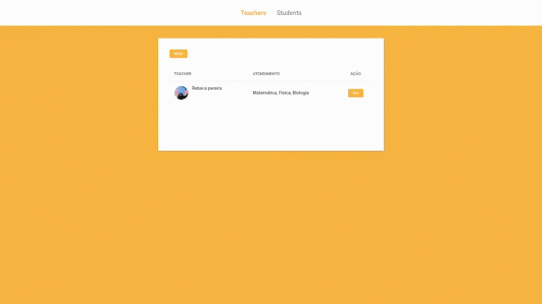

# Private Lessons

<h1>
    
</h1>

### 📝Sobre
Private Lessons é uma plataforma de gerenciamento de aulas particulares, onde é possível cadastrar alunos e professores, tendo controle sobre quais matérias estão sendo ministradas por cada um dos profissionais de ensino, e a quantidade de carga horaria de cada aluno.

----

### 🚩Pré Requisitos

- [Git](https://git-scm.com/)
- [Node](https://nodejs.org)

----

### 📂Instalação

```bash
# Clone este repositório
$ git clone https://github.com/Jacoappolinario/Private-Lessons.git

# Vá para o repositório
$ cd Private-Lessons

# Instalar dependências
$ npm install

# Execute o aplicativo
$ npm start
```

---

## 🚀Tecnologias

- NodeJs
- Express
- Nodemon
- Nunjucks
- HTML
- CSS
- JS

----

## 👨🏾‍💻Autor
* **Jacó Apolinário** - [Linkedin](https://www.linkedin.com/in/jacoapolinario/)


----

## 🧾License

Esse projeto está sob a licença MIT. Veja o arquivo [LICENSE](/LICENSE) para mais detalhes.

